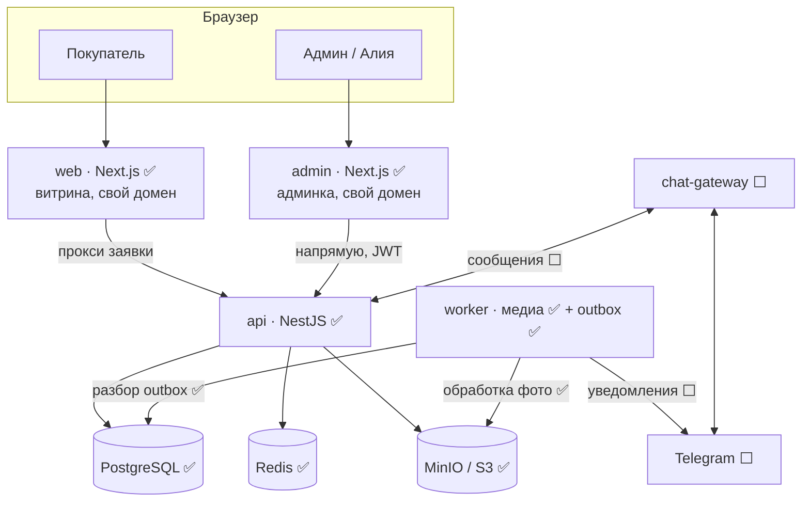
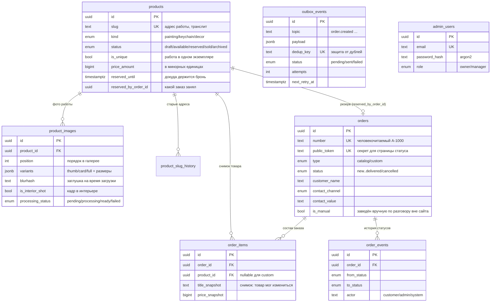
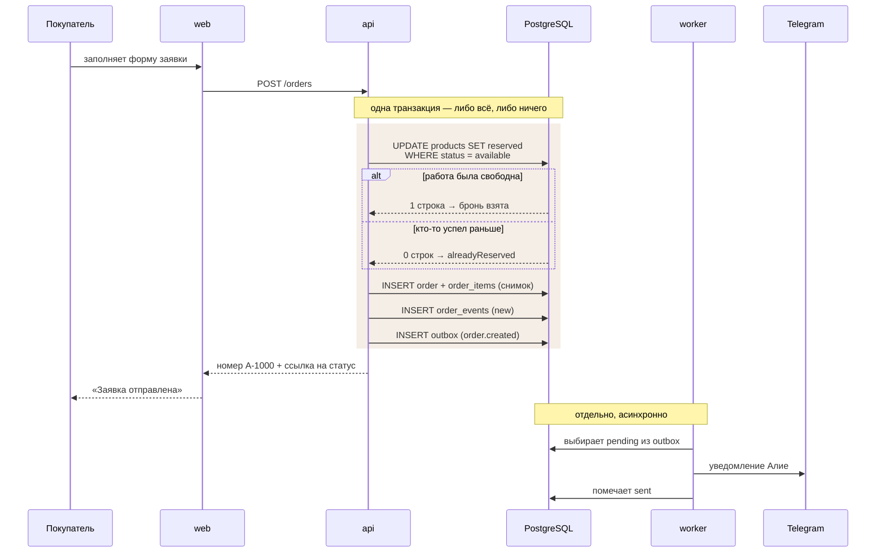
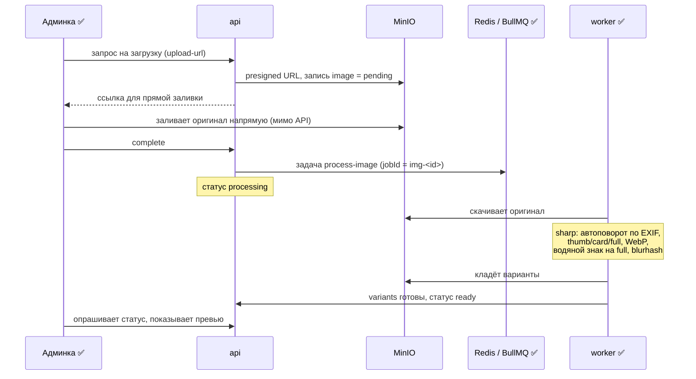
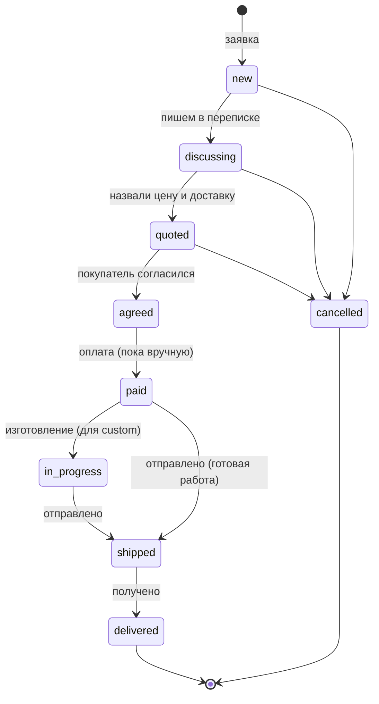
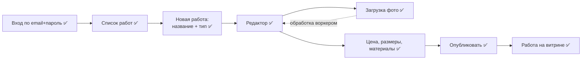

# Как устроен artshop

Живой документ: обновляется по мере появления функционала. Для ревью по схемам,
а не по коду. Технические обоснования решений — в [architecture.md](architecture.md).

Отметки готовности: ✅ сделано и проверено · 🟡 частично · ⬜ впереди.

---

## Сервисы и как они связаны

Витрина и админка — **разные приложения со своим движком и своим доменом**.
Общее у них — только пакеты (`shared` контракты, `db` схема) и токены дизайна.
Так правки в одном не роняют другое, и каждое деплоится и масштабируется отдельно.

Кто за что отвечает:

| Приложение | Делает | Статус |
|---|---|---|
| `web` | витрина, свой домен | ✅ |
| `admin` | админка, свой домен и движок | ✅ |
| `api` | каталог, заказы, авторизация, CRUD работ, загрузка фото — владеет БД | ✅ |
| `worker` | разбор outbox, обработка фото, расписания | ✅ (кроме уведомлений) |
| `chat-gateway` | мессенджеры: вебхуки, отправка | ⬜ |

Общее (монорепо-пакеты): `packages/shared` (zod-контракты, деньги),
`packages/db` (схема Drizzle), design-токены. Витрина обращается к API через
свой серверный прокси; админка — клиентское приложение, ходит в API напрямую
с JWT-токеном.

---

## Таблицы базы

Три сквозных правила модели:

- **деньги** — всегда целое число в минорных единицах (тиын/копейка) + код валюты, никогда не дробью;
- **ничего не удаляется** — проданное и отменённое остаётся, работает статус;
- **снимки в заказе** — название и цена копируются в `order_items`, потому что товар потом может измениться или уйти в архив.

---

## Поток: покупатель оставляет заявку ✅

Готово и проверено. Ключевой момент — резерв уникальной работы и защита от гонки.

Почему именно так:

- **резерв условным UPDATE, а не блокировкой.** `WHERE status = 'available'` уже
  атомарен: два одновременных запроса не могут оба его пройти. Отдельная
  распределённая блокировка тут была бы лишней. Проверено: вторая заявка на ту же
  работу получает `alreadyReserved`, а не вторую бронь.
- **outbox в той же транзакции.** Уведомление пишется в БД вместе с заказом.
  Упади процесс сразу после — заявка не потеряется, воркер разберёт outbox позже.
  Отправка отделена от приёма: покупатель не ждёт, пока достучимся до Telegram.
- **ретраи.** Не доставили — пробуем через 1, 2, 4… минуты, до 6 раз, потом `failed`.

> Сейчас у воркера нет токена бота, поэтому уведомление пишется в лог, а не в
> Telegram. Подключение — вместе с chat-gateway.

---

## Поток: обработка фотографии ✅

Готово и проверено насквозь: загрузил фото в админке → воркер сделал варианты →
работа опубликована → изображение видно на витрине.

Ключевое:

- оригиналы грузятся **напрямую в хранилище** по presigned URL, минуя API:
  восьмимегабайтные файлы не должны идти через приложение;
- задача идемпотентна по `jobId = img-<imageId>`: повторное подтверждение не создаёт
  вторую обработку;
- обработка асинхронна, админка опрашивает статус и показывает «обработка…»,
  пока воркер не отдаст `ready`;
- **опубликовать нельзя без готового фото** — кнопка заблокирована, пока нет
  хотя бы одного `ready`-изображения.

---

## Жизненный цикл заказа

Позже между `agreed` и `paid` встроится платёжный шлюз — без изменения остальной
схемы. Бронь работы снимается фоновой задачей, если заказ так и не дошёл до `agreed`.

---

## Поток: Алия ведёт каталог ✅

Проверено в браузере: вход → создание → фото → публикация → работа на витрине.

Правила, заложенные в интерфейс:

- **slug генерится транслитом из названия** (`Морской бриз` → `morskoy-briz`),
  правится вручную; при смене опубликованного адреса старый пишется в историю
  для редиректа;
- **цена вводится в тенге, хранится в тиынах** целым числом — перевод в UI;
- **размеры в сантиметрах**, в БД в миллиметрах;
- публикация возможна только с готовым фото.

---

## Что дальше по функционалу

| Кусок | Статус |
|---|---|
| Публичный каталог | ✅ |
| Авторизация админки | ✅ |
| Заявка с резервом + outbox | ✅ |
| Админка: создание и редактирование работ | ✅ |
| Загрузка и обработка фото | ✅ |
| Публикация работы на витрину | ✅ |
| Уведомление в Telegram (реальное) | ⬜ ждёт токен |
| Ревалидация витрины по событию из админки | ⬜ |
| Канбан заказов | ⬜ |
| Страница статуса на живых данных | ⬜ |
| chat-gateway, Mini App | ⬜ |
