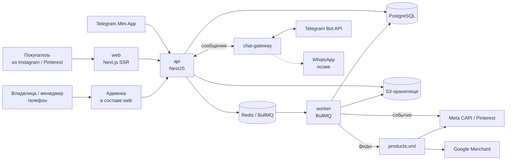

# Архитектура

## Общая схема



Четыре развёртываемые части. Разделение проведено **по способу выполнения**, а не ради
слова «микросервисы»:

- `web` - рендеринг и SEO, живёт по своим правилам кеширования;
- `api` - синхронные операции, отвечает быстро и не делает тяжёлой работы;
- `worker` - долгое и отложенное: обработка медиа, фиды, события, расписания;
- `chat-gateway` - мессенджеры: вебхуки, нормализация, отправка. Подробно
  в [chat-gateway.md](chat-gateway.md).

Шлюз выделен не ради количества сервисов, а потому что проходит тот же критерий:
у вебхуков провайдеров иной профиль нагрузки, чем у CRUD админки; провайдеры меняют
API независимо от магазина; недоступность мессенджера не должна влиять на приём заказов;
и сам шлюз ничего не знает про магазин, то есть переиспользуем.

Дальше этого дробить не будем. Магазин такого размера, разложенный на восемь сервисов,
читается как оверинжиниринг и работает в минус.

---

## Почему Next.js на фронте

Причина не в моде, а в выручке:

- **SEO.** Карточка работы должна попадать в поиск по запросам вида «купить картину
  маслом [город]». Клиентский рендер здесь проигрывает.
- **Скорость на мобилке.** Трафик приходит из Instagram и Pinterest, то есть телефон
  и нередко плохая сеть. Порог примерно такой: при LCP больше 2.5 секунд уходит
  значительная часть посетителей.
- **Изображения.** Встроенная оптимизация и ленивая загрузка - для магазина картин
  это не удобство, а основная механика страницы.

Админка живёт внутри того же приложения под `/admin`, отдельным layout и без SSG.
Держать её отдельным SPA нет смысла: пользователей двое.

---

## SEO и режимы рендеринга

Важное разграничение: **рендеринг решает только то, чтобы бот увидел HTML вместо
пустого контейнера.** Это необходимое условие, а не достаточное - основную работу
делает то, что перечислено ниже под рендерингом.

### Режим по страницам

| Страница | Режим | Почему |
|---|---|---|
| главная, каталог, карточка работы | SSG + ISR | контент меняется раз в несколько дней; страница генерится один раз и отдаётся как файл - быстрее SSR и дешевле |
| об авторе, доставка и оплата | SSG | статика в чистом виде |
| админка (`/admin`) | клиентский рендер, `noindex` | индексировать нечего |
| статус заказа по токену | SSR, `noindex` | персональные данные, кешировать нельзя |

**ISR с ревалидацией по событию.** Страницы статичны, но пересобираются: по таймеру
и **по требованию** - при публикации или изменении работы `api` дёргает ревалидацию
нужного пути. Получаем скорость статики при актуальности динамики. По сути это кеш
с TTL плюс инвалидация по событию, только на уровне отрендеренных страниц.

### Что действительно приносит трафик

По убыванию отдачи:

1. **Structured data (Schema.org `Product`).** Разметка JSON-LD с ценой, наличием,
   изображениями и автором. Google показывает карточку с ценой прямо в выдаче,
   а не просто ссылку - разница в кликабельности кратная. Для магазина это главное.
2. **OG-теги.** Не про поиск, а про соцсети, откуда пойдёт весь трафик первые месяцы.
   Ссылка в WhatsApp или сторис должна разворачиваться карточкой с фото, названием
   и ценой.
3. **Core Web Vitals.** Скорость - фактор ранжирования, а сайт состоит из тяжёлых
   фотографий. Работает связка `next/image` + AVIF/WebP из воркера + `priority`
   на первое фото карточки + blurhash вместо прыгающего layout.
4. **Метаданные на каждую страницу** через `generateMetadata` - из данных работы,
   а не одинаковые на весь сайт.
5. **`sitemap.xml`, `robots.txt`** генерируются из БД + **IndexNow** для быстрого
   уведомления Яндекса и Bing о новых страницах.
6. **Проданные работы остаются в каталоге.** Решение принято ради соцдоказательства,
   но SEO-эффект не меньше: за год накапливается сотня страниц под низкочастотные
   запросы. Удалять их - выбрасывать накопленный трафик.

Отдельно: в СНГ **Яндекс важнее Google** - свой Вебмастер, свои требования, больший
вес поведенческих факторов. Регистрируемся в обоих.

### Реалистичные ожидания

По запросу «купить картину» выйти невозможно - там маркетплейсы с бюджетами.
Рабочая стратегия - низкочастотка: «картина маслом [город]», «брелок с именем
на заказ», «подарок ручной работы [город]».

Срок до первого ощутимого органического трафика для нового домена - **3-6 месяцев**.
Поэтому приоритет: OG-теги и скорость дают эффект с первого дня через соцсети,
structured data и sitemap делаются сразу, но отдача отложена.

---

## Адреса страниц (slug)

**Slug** - человекочитаемая часть адреса, идентифицирующая страницу:
`/works/kartina-zakat-nad-stepyu`.

Почему не идентификатор из БД:

- ссылка вида `/works/8f3a91c2-4b1d-...` в мессенджере выглядит как спам, по такой
  не кликают;
- слова в адресе - фактор ранжирования, и адрес виден пользователю в выдаче;
- slug можно продиктовать голосом, uuid - нет.

**Формат: транслит, строчные буквы, дефисы.** Кириллица в адресе технически работает,
но при копировании превращается в `%D0%BA%D0%B0%D1%80...` - и именно это уедет
в мессенджер вместо красивой ссылки. Генерится автоматически из названия,
редактируется вручную в админке до публикации.

**Опубликованный slug не меняется.** Он уже разошёлся по перепискам и проиндексирован.
Если правка всё же необходима, старый адрес обязан отвечать редиректом 301 на новый -
для этого нужна таблица истории `product_slug_history` (`slug`, `product_id`,
`replaced_at`). Закладывается сразу: прикрутить это к работающему сайту, потеряв
позиции, гораздо дороже.

## Языковые версии

Русский - по умолчанию и без префикса, английский - префиксом: `/en/works/...`.

Выбран префикс, а не поддомен: весь вес домена копится в одном месте, настройка проще
и дешевле. На каждой странице проставляется `hreflang` на альтернативную версию,
иначе поисковик сочтёт версии дублями и понизит обе.

---

## Ключевые потоки

### 1. Загрузка фотографии

```
админка -> API: запрос на загрузку
API -> S3: presigned URL
админка -> S3: заливает оригинал напрямую (мимо API)
админка -> API: сообщает, что файл на месте
API -> BullMQ: задача обработки
worker: скачивает оригинал -> генерирует thumb / card / full
        -> WebP и AVIF -> водяной знак на full -> blurhash
        -> кладёт в S3 -> обновляет product_images.variants
```

Загрузка идёт напрямую в хранилище по presigned URL: API не должен пропускать
через себя восьмимегабайтные файлы. Обработка асинхронна, в админке виден статус.

При падении задачи - ретраи с backoff, после исчерпания попыток запись помечается
`failed` и попадает в отдельную вкладку админки.

### 2. Заявка на работу

```
покупатель -> web: заполняет форму
web -> API: POST /orders
API в транзакции:
    - проверяет, что товар доступен
    - для уникального: status -> reserved, reserved_until = now + N часов
    - создаёт order + order_items со снимками названия и цены
    - пишет outbox_events: уведомление в Telegram, событие Lead в CAPI
API -> покупателю: номер заказа + ссылка на страницу статуса
worker: разбирает outbox, шлёт в Telegram и в Meta
```

**Гонка.** Уникальная работа - ровно одна. Проверка доступности и перевод в `reserved`
делаются одним `UPDATE ... WHERE status = 'available'` с проверкой числа затронутых
строк. Если ноль - товар успели забронировать, покупатель получает понятное сообщение
и предложение встать в лист ожидания. Отдельная блокировка не нужна: условие в самом
`UPDATE` уже атомарно.

Истёкшие брони снимает периодическая задача - товар возвращается в `available`,
если заказ так и не дошёл до `agreed`.

### 3. Отправка наружу: outbox

Всё, что уходит во внешние системы - Telegram, Meta CAPI, письма - пишется
в `outbox_events` в **той же транзакции**, что и бизнес-изменение. Отправляет воркер.

Зачем так, а не «отправить прямо в обработчике»:

- заявка не должна потеряться из-за того, что Telegram недоступен;
- HTTP-ответ покупателю не ждёт внешних сервисов;
- ретраи и дедупликация живут в одном месте;
- при падении процесса ничего не теряется - неотправленное остаётся в таблице.

`dedup_key` уникален, поэтому повторная запись того же события невозможна,
а повторная отправка безопасна.

### 4. Трекинг конверсий: Pixel + Conversions API

Браузерный пиксель режется блокировщиками и ограничениями браузеров, из-за чего
часть конверсий не доходит и реклама учится на неполных данных. Лечится дублированием
с сервера.

```
web: генерирует event_id (uuid) на событие
web -> Meta Pixel:      { event: 'Lead', event_id }
web -> API -> outbox -> worker -> Meta CAPI: { event: 'Lead', event_id, ... }
Meta склеивает два события по event_id в одно
```

Тот же механизм переиспользуется для Pinterest и Google. Персональные данные
в серверных событиях передаются только в хешированном виде, как требует API.

### 5. Товарные фиды

Периодическая задача собирает `products.xml` в формате Meta / Google Shopping,
кладёт в S3, отдаётся по стабильному URL. Площадки забирают сами по расписанию.

Пересборка - по расписанию плюс при изменении опубликованного товара, с дебаунсом,
чтобы правка десяти работ подряд не собирала фид десять раз.

Один фид обслуживает Meta, Pinterest и Google Merchant. Различия форматов -
несколько необязательных полей, а не отдельные генераторы.

---

## Мультивалютность

- цена хранится в базовой валюте целым числом в минорных единицах;
- витрина показывает цену в валюте посетителя, пересчитывая по актуальному курсу;
- **в момент согласования заказа курс фиксируется** в самом заказе.

Последнее - неочевидное, но важное: без фиксации сумма, названная в переписке,
разъезжается с суммой в системе через неделю. Спорить с покупателем о курсе -
худший способ закрыть сделку.

---

## Международная отправка

Влияет на модель данных сильнее, чем на код, поэтому закладывается сразу:

- у товара есть вес, габариты, признак хрупкости и таможенная категория;
- у **оригинальных произведений искусства** товарная позиция отличается от сувенирной,
  и правила ввоза в ряде стран для них иные - это поле `customs_category`;
- в ЕС нет беспошлинного порога, НДС берётся с первого евро и оплачивается получателем.
  Это лечится не кодом, а честной строкой при оформлении: отсутствие такой строки даёт
  скандалы и возвраты.

Автоматический расчёт доставки по API перевозчика - в максимуме. На старте зоны
с фиксированной ценой и уточнение в переписке.

---

## Решения и обоснования

| Решение | Альтернатива | Почему так |
|---|---|---|
| заказ с согласованием | чекаут с корзиной и оплатой | доставку хрупкого негабарита в другую страну нельзя посчитать заранее; уникальная работа требует разговора; не нужны ИП и шлюз для запуска |
| четыре части (web / api / worker / chat-gateway) | монолит или много микросервисов | разделение по способу выполнения; дробить магазин на 30 товаров сильнее - оверинжиниринг |
| chat-gateway отдельным сервисом | обработка вебхуков внутри api | иной профиль нагрузки, независимые релизы под изменения провайдеров, изоляция отказа мессенджера, переиспользуемость вне магазина |
| Telegram Bot API | MTProto через пользовательский аккаунт | боту достаточно токена и вебхука: нет сессий, авторизации по номеру и риска блокировки аккаунта |
| интерфейс провайдера спроектирован под несколько мессенджеров сразу | вывести абстракцию после второго провайдера | обычно правило верное, но здесь точки расхождения известны заранее из прод-опыта с несколькими провайдерами; реализация при этом одна - Telegram |
| диалоги и сообщения принадлежат `api` | хранение переписки в шлюзе | шлюз - транспорт; смысл (связь с заказом, права, отображение) живёт там же, где остальная бизнес-логика |
| Next.js | SPA на Vite | SEO и скорость на мобилке напрямую влияют на выручку |
| NestJS в API | Fastify | много CRUD, DI, guards, Swagger; hot path тут отсутствует |
| outbox | прямые вызовы из обработчика | внешние системы падают, заявки терять нельзя |
| presigned upload | загрузка через API | не пропускать 8 МБ через приложение |
| `UPDATE ... WHERE status` | распределённая блокировка | условие в UPDATE уже атомарно, redlock здесь избыточен |
| деньги в минорных единицах | numeric / float | ошибки округления в деньгах недопустимы |
| мягкое удаление | физическое | проданные работы продолжают приводить трафик и работают как соцдоказательство |
| SSG + ISR на витрине | SSR на каждый запрос | контент меняется раз в несколько дней; статика быстрее и дешевле, актуальность даёт ревалидация по событию |
| slug транслитом | кириллица в адресе или uuid | кириллица уезжает в мессенджер как `%D0%BA%D0%B0%D1%80...`; uuid нечитаем и не кликается |
| история slug с редиректом 301 | смена адреса без следа | опубликованный адрес уже разошёлся по перепискам и проиндексирован |
| язык префиксом `/en/` | поддомен или отдельный домен | вес домена копится в одном месте, настройка дешевле |
| один фид на все площадки | генератор под каждую | форматы различаются несколькими полями |

---

## Наблюдаемость

Минимально необходимое (переносится из рабочего опыта почти без затрат):

- `http_request_duration_seconds` по маршрутам;
- длина очередей BullMQ и время обработки задач;
- `outbox_pending_total` и возраст самого старого неотправленного события -
  главный индикатор здоровья интеграций;
- время генерации вариантов изображения;
- ошибки внешних API по провайдерам.

Алерты: сайт недоступен, воркер не берёт задачи, outbox копится дольше пяти минут,
фид не собрался за сутки.

---

## Что осознанно НЕ делается

- личные кабинеты покупателей, вишлисты, сравнение товаров - нулевая отдача
  при таком каталоге;
- собственный приём карт - это лицензии и ответственность, для этого есть агрегаторы;
- рекомендательная система - при тридцати работах она вырождается в «показать все»;
- микросервисная нарезка ради резюме - вредит и продукту, и впечатлению на интервью.
